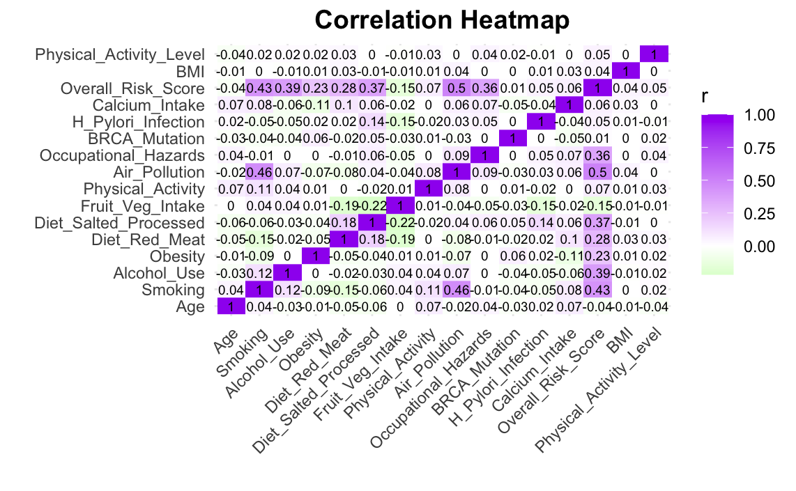

# Cancer Risk Factors Analysis (R)

This project explores relationships between age, lifestyle habits, and environmental exposures in a **Cancer Risk Factors** dataset (sourced from [Kaggle](https://www.kaggle.com/datasets/tarekmasryo/cancer-risk-factors-dataset).  
All analysis and visualization are done in **R** using tidyverse, ggplot2, gt, and related packages.

---

## Overview

- **Objective:** Identify correlations among key cancer risk factors such as smoking, alcohol use, and diet.  
- **Techniques Used:** Data wrangling, visualization, and correlation analysis.  
- **Output:** Markdown report (`.md`) automatically generated via R Markdown (`.Rmd`) for GitHub display.

---

## Key Visuals

- **Density plots** of age by cancer type  
- **Boxplots** of prevalence by age group  
- **Heatmap** of risk factor correlations  
- **Summary tables** (generated using `kable` and `gt`)

- 

---

## How to run this project

1. Clone the repository:
   ```bash
   git clone https://github.com/joyceteng/cancer-analysis.git
2. Head to Rstudio and install the required packages:
   install.packages(c("tidyverse", "gt", "corrplot", "kableExtra", "reshape2"))
